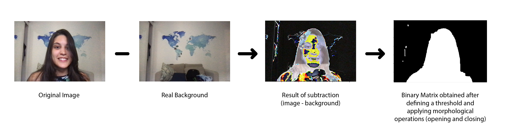

# Virtua lBackground

OpenCV implementation of the feature that replaces the webcam background with an image

## Installation

Install python
```
sudo apt-get update
sudo apt-get install python3.6
```

Create a virtual environment called "venv" and activate it
```
python3 -m venv venv
source venv/bin/activate
```

Install the required packages
```
python3 -m pip install -r requirements.txt
```

## Usage 

Run the application
```
python app.py
```

## Overview

The project is divided into two files:

### VirtualBg
This file contains the algorithm with background replacement, which requires 3 images:
- The original image, in which we want to insert a virtual background
- An image with the real background
- An image with the virtual background 

Initially, we subtract the actual background from the original photo and use a user-defined threshold to create a binary image, in which morphological opening and closing operations are applied to remove noise.



Then, the binary matrix multiplied by the original image, obtaining an image with no background. Likewise, the inverse of the binary matrix is used to remove the foreground region in the virtual background image. Finally, these two images are added together.


### App

This script uses the tkinter module to create a GUI for
1. Selecting a desired virtual background image
2. Taking a picture of the real background using webcam
3. Controlling the background replacement algorithm paramenters (binary image threshold and opening/closing kernel size)
